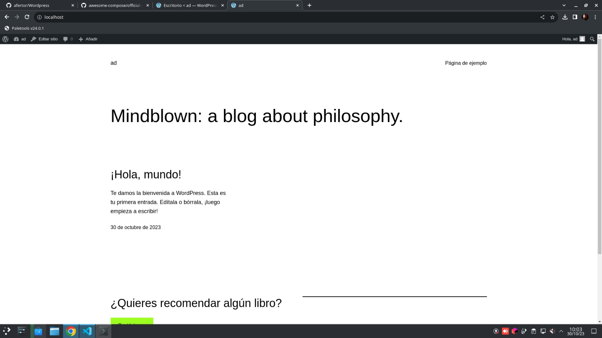

# Instalación Wordpress

#### 1. Primero paso.
Lo primero que debemos hacer es buscar toda la información que necesitemos sobre wordpress para su instalación.
<br>

#### 2. Segundo paso.
Ahora debemos buscar la imagen de wordpress en la pagina oficial de docker ([Imagen Wordpress](https://docs.docker.com/samples/mariadb/)) Dentro de ese enlace solo tendremos que entrar en el link que dice "Compose and Wordpress" y nos llevará al repositorio de github.
<br>

#### 3. Tercer paso.
Ahora debemos quedarnos con el contenido del docker-compose el cual está en el repositorio que anteriormente nombramos. Esto sería el codigo que tendríamos que introducir en nuestro archivo compose:
 ```yaml
 services:
  db:
    # We use a mariadb image which supports both amd64 & arm64 architecture
    image: mariadb:10.6.4-focal
    # If you really want to use MySQL, uncomment the following line
    #image: mysql:8.0.27
    command: '--default-authentication-plugin=mysql_native_password'
    volumes:
      - db_data:/var/lib/mysql
    restart: always
    environment:
      - MYSQL_ROOT_PASSWORD=somewordpress
      - MYSQL_DATABASE=wordpress
      - MYSQL_USER=wordpress
      - MYSQL_PASSWORD=wordpress
    expose:
      - 3306
      - 33060
  wordpress:
    image: wordpress:latest
    volumes:
      - wp_data:/var/www/html
    ports:
      - 80:80
    restart: always
    environment:
      - WORDPRESS_DB_HOST=db
      - WORDPRESS_DB_USER=wordpress
      - WORDPRESS_DB_PASSWORD=wordpress
      - WORDPRESS_DB_NAME=wordpress
volumes:
  db_data:
  wp_data:
 ```

A continuación voy a explicar los diferentes parametros de este código:

+ **db**: Es un servicio con nombre de servidor llamado "db".
  + **image**: Se refiere a la imagen del contenedor que puedes encontrar en Docker Hub, en este caso, se utiliza la imagen "mariadb:10.6.4-focal".
  + **command**: Se utiliza para ejecutar un comando, en este caso, se emplea para configurar el plugin de MySQL con el comando: '--default-authentication-plugin=mysql_native_password'.
  + **volumes**: Se utiliza para personalizar el almacenamiento y evitar el uso de la carpeta predeterminada.
  + **environment**: Se utiliza para definir la configuración de la base de datos.
  + **expose**: Se configura para permitir que otros contenedores accedan a través de los puertos especificados.
+ **wordpress**: Servicio el cual tiene algunos parámetros parecidos a los del anterior servicio.
  + **image**: Se refiere a la imagen del contenedor que puedes encontrar en Docker Hub, en este caso, se utiliza la imagen "mariadb:10.6.4-focal".
  + **ports**: Mediante este parámetro podremos mapear los puertos del contador.
  + **enviroment**: Se utiliza para definir la configuración de la base de datos.

 Cuando terminemos la declaracion de todos los servicios declararemos los volumenes que usamos.
<br>

#### 4. Cuarto paso.
Después de tener creado y configurado nuestro archivo docker compose debemos iniciarlo con el siguiente comando `docker compose up -d` y ya tendríamos lanzado el programa.
<br> 

#### 5. Quinto paso
Después de tener el programa lanzado nos iremeos al navegador a que todo esta funcionando de manera correcta. Para esto en el navegador escribiremos `localhost` o directamente introduciremos nuestra ip y debería aparecernos lo siguiente:




